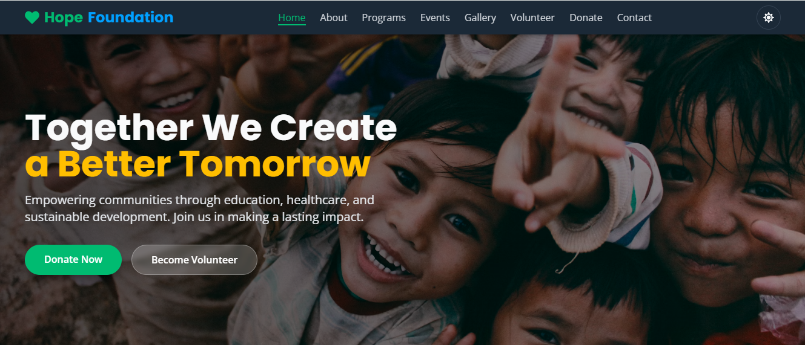
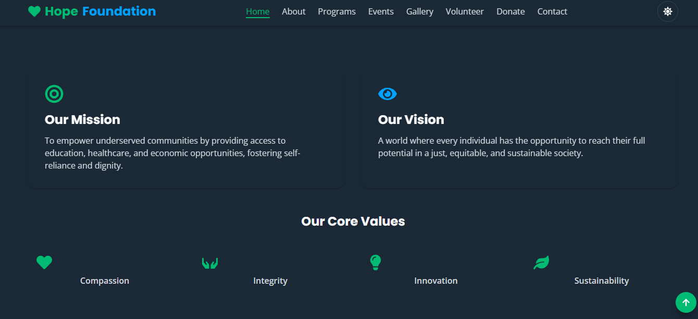
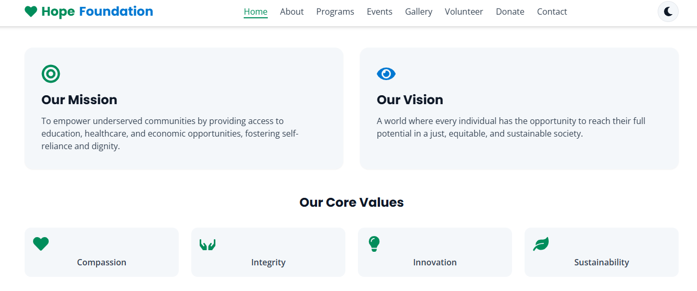
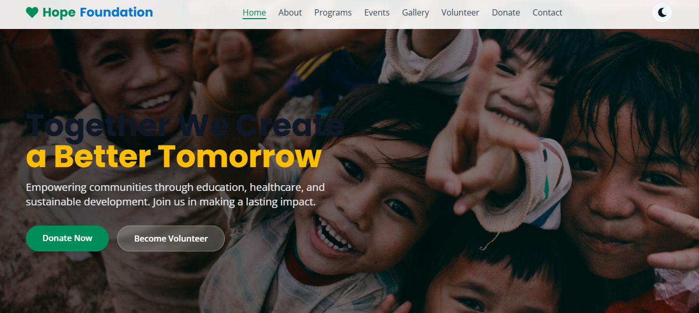

# 🌟 Hope Foundation - NGO Website





https://hope-foundation-sepia.vercel.app/

> **Together We Create a Better Tomorrow** 🌍

A modern, responsive, and fully accessible NGO website built with React.js, Vite, and Tailwind CSS. This project demonstrates a production-ready frontend application with dark/light theme support, smooth animations, and SEO optimization.

## 📋 Table of Contents

- [🌟 About](#-about)
- [🎯 Features](#-features)
- [🎨 Color Palette](#-color-palette)
- [📁 Project Structure](#-project-structure)
- [🚀 Getting Started](#-getting-started)
- [📱 Responsive Design](#-responsive-design)
- [🌓 Dark/Light Theme](#-darklight-theme)
- [🎬 Animations](#-animations)
- [♿ Accessibility](#-accessibility)
- [🔧 Technologies Used](#-technologies-used)
- [📦 Dependencies](#-dependencies)
- [📄 Pages](#-pages)
- [🧩 Components](#-components)
- [📊 Performance](#-performance)
- [🤝 Contributing](#-contributing)
- [📄 License](#-license)

## 🌟 About

**Hope Foundation** is a non-profit organization dedicated to empowering communities through education, healthcare, food distribution, and sustainable development. This website serves as a digital presence to showcase the organization's work, attract volunteers, and facilitate donations.

### Mission
To empower underserved communities by providing access to education, healthcare, and economic opportunities, fostering self-reliance and dignity.

### Vision
A world where every individual has the opportunity to reach their full potential in a just, equitable, and sustainable society.

## 🎯 Features

### ✨ Core Features
- ✅ **Full Responsive Design** - Mobile-first approach for all devices
- ✅ **Dark/Light Theme** - Smooth theme toggle with persistence
- ✅ **Reusable Components** - Modular and maintainable codebase
- ✅ **React Router** - 9 pages with lazy loading
- ✅ **SEO Optimized** - Meta tags, Open Graph, Twitter Cards
- ✅ **Accessibility (WCAG)** - ARIA labels, keyboard navigation
- ✅ **Smooth Animations** - AOS library integration
- ✅ **High Performance** - Code splitting, lazy loading

### 🎨 UI/UX Features
- ✅ **Sticky Navbar** - Hide/show on scroll
- ✅ **Scroll Progress Bar** - Visual scroll indicator
- ✅ **Back to Top Button** - Smooth scroll to top
- ✅ **Animated Counters** - Impact statistics
- ✅ **Image Lightbox** - Gallery with lightbox
- ✅ **Accordion FAQ** - Collapsible sections
- ✅ **Contact Form** - With validation and submission simulation
- ✅ **Google Maps Integration** - Interactive map
- ✅ **Newsletter Signup** - Email subscription UI

### 📱 Responsive Breakpoints
| Device | Breakpoint | Container Width | Padding |
|--------|-----------|-----------------|---------|
| Mobile | < 640px | 100% | 1rem |
| Tablet | 640px - 1023px | 640px | 1.5rem |
| Laptop | 1024px - 1279px | 1024px | 2rem |
| Desktop | 1280px - 1535px | 1280px | 2rem |
| Large Desktop | 1536px+ | 1536px | 2rem |

## 🎨 Color Palette

| Color Name | Hex Code | Usage |
|------------|----------|-------|
| Primary | `#2E8B57` | Buttons, headers, accents |
| Secondary | `#1976D2` | Links, secondary elements |
| Accent | `#FFC107` | Highlights, CTAs |
| Light | `#F5F7FA` | Backgrounds, cards |
| Dark | `#1a1a2e` | Footer, dark sections |
| White | `#FFFFFF` | Text, backgrounds |
| Text | `#1f2937` | Body text |

### Typography
- **Headings**: Poppins
- **Body**: Open Sans

## 📁 Project Structure
hope-foundation/
│
├── public/
│ └── vite.svg
│
├── src/
│ ├── assets/ # Static assets
│ ├── components/ # Reusable components
│ │ ├── Navbar.jsx
│ │ ├── Hero.jsx
│ │ ├── About.jsx
│ │ ├── MissionVision.jsx
│ │ ├── Programs.jsx
│ │ ├── ProgramCard.jsx
│ │ ├── Impact.jsx
│ │ ├── WhyChooseUs.jsx
│ │ ├── SuccessStories.jsx
│ │ ├── UpcomingEvents.jsx
│ │ ├── VolunteerSection.jsx
│ │ ├── Testimonials.jsx
│ │ ├── Gallery.jsx
│ │ ├── DonateCTA.jsx
│ │ ├── FAQ.jsx
│ │ ├── Contact.jsx
│ │ ├── Footer.jsx
│ │ ├── ScrollToTop.jsx
│ │ ├── LoadingScreen.jsx
│ │ └── BackToTop.jsx
│ │
│ ├── pages/ # Page components
│ │ ├── Home.jsx
│ │ ├── About.jsx
│ │ ├── Programs.jsx
│ │ ├── Events.jsx
│ │ ├── Gallery.jsx
│ │ ├── Volunteer.jsx
│ │ ├── Donate.jsx
│ │ ├── Contact.jsx
│ │ └── NotFound.jsx
│ │
│ ├── context/ # React Context
│ │ └── ThemeContext.jsx
│ │
│ ├── data/ # Mock data
│ │ └── mockData.js
│ │
│ ├── hooks/ # Custom hooks
│ ├── App.jsx
│ ├── main.jsx
│ └── index.css
│
├── index.html
├── package.json
├── vite.config.js
├── tailwind.config.js
├── postcss.config.js
└── README.md

text

## 🚀 Getting Started

### Prerequisites
- Node.js (v16 or higher)
- npm or yarn package manager

### Installation

1. **Clone the repository**
```bash
git clone https://github.com/yourusername/hope-foundation.git
cd hope-foundation
Install dependencies

bash
npm install
Start development server

bash
npm run dev
Open in browser

text
http://localhost:5173/
Build for Production
bash
npm run build
Preview Production Build
bash
npm run preview
Lint Code
bash
npm run lint
📱 Responsive Design
The website is built with a Mobile-First approach, ensuring optimal viewing experience across all devices:

Mobile (< 640px)
Single column layouts

Collapsible navigation

Touch-friendly buttons

Optimized images

Tablet (640px - 1023px)
Two column grids

Expanded navigation

Larger touch targets

Tablet-optimized images

Laptop (1024px - 1279px)
Multi-column layouts

Full navigation

Desktop-optimized typography

Enhanced animations

Desktop (1280px+)
Maximum content width

Full feature set

Advanced animations

High-resolution images

🌓 Dark/Light Theme
The website features a seamless dark/light theme toggle with:

System Preference Detection - Respects user's OS settings

Local Storage Persistence - Remembers user preference

Smooth Transitions - All elements transition smoothly

High Contrast - Excellent readability in both modes

Toggle Usage
Click the sun/moon icon in the navbar to toggle themes. The preference is saved automatically.

🎬 Animations
Integrated Animations
AOS (Animate On Scroll) - Scroll-triggered animations

Fade Up - Elements fade in while moving up

Slide Left/Right - Elements slide in from sides

Zoom - Elements scale up on scroll

Float - Continuous floating animation

Pulse - Gentle pulsing effect

Animation Configuration
javascript
AOS.init({
  duration: 800,     // Animation duration
  once: true,        // Animate only once
  offset: 50,        // Offset trigger point
  delay: 0,          // Default delay
  easing: 'ease'     // Easing function
});
♿ Accessibility
Features
✅ ARIA Labels - Screen reader support

✅ Keyboard Navigation - Full keyboard accessibility

✅ Focus States - Visible focus indicators

✅ Alt Text - All images have descriptive alt text

✅ Color Contrast - WCAG 2.1 compliant

✅ Semantic HTML - Proper heading hierarchy

✅ Skip Links - Skip to main content

✅ Form Labels - All inputs have labels

Keyboard Shortcuts
Key	Action
Tab	Navigate through interactive elements
Enter	Activate buttons and links
Space	Toggle checkboxes and buttons
Escape	Close modals and dropdowns
🔧 Technologies Used
Frontend
React 18.2.0 - UI Library

Vite 5.0.8 - Build Tool

React Router 6.20.1 - Routing

Tailwind CSS 3.3.6 - Styling

AOS 2.3.4 - Scroll Animations

Icons & UI
React Icons 4.11.0 - Icon Library

React CountUp 6.5.3 - Animated Counters

React Intersection Observer 9.5.3 - Scroll Detection

Development Tools
ESLint - Code Linting

PostCSS - CSS Processing

Autoprefixer - CSS Prefixing